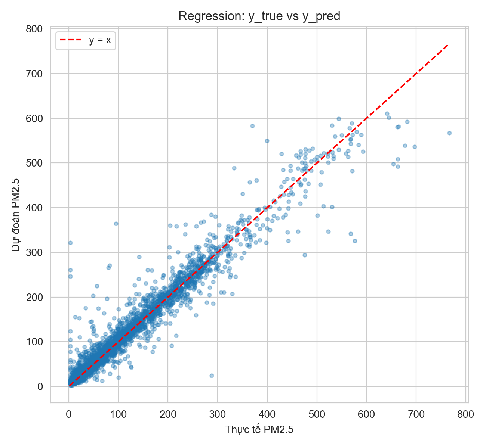
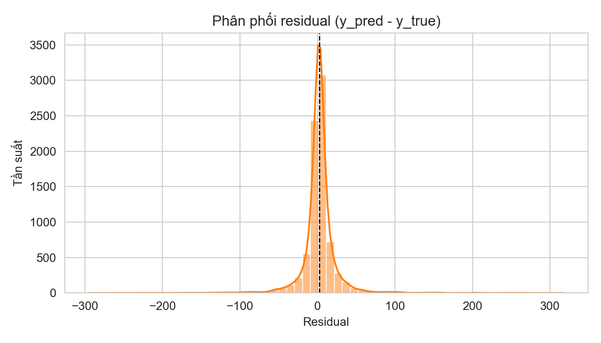
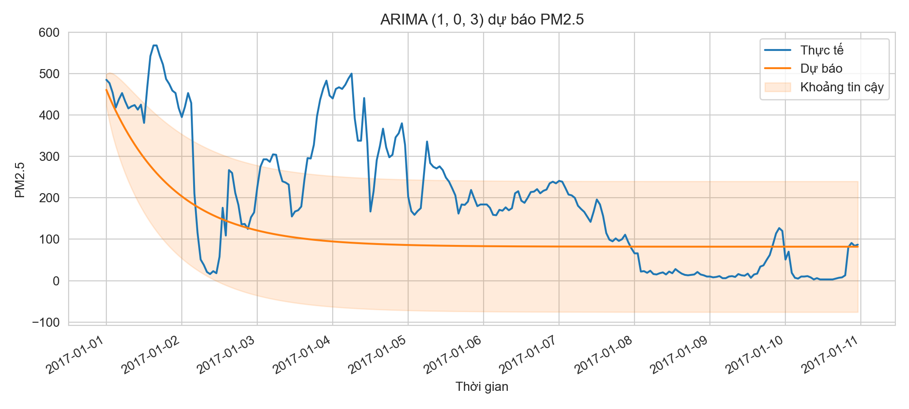
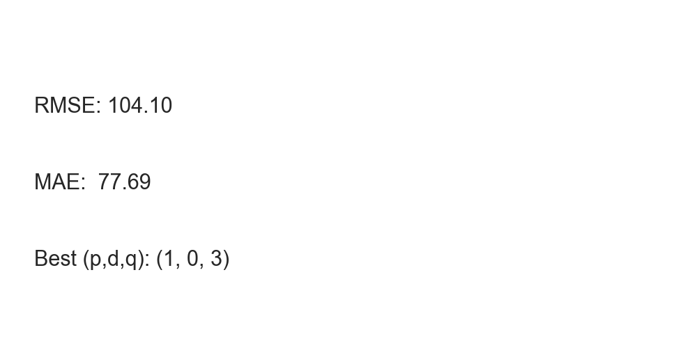

# Dự đoán chất lượng không khí PM2.5 theo giờ tại Bắc Kinh

> **Báo cáo học phần Data Mining - Lab 4: Time Series**  
> Sinh viên thực hiện: Nhóm 7
- 1771040011 - Bế Quang Hải
- 1771040024 - Nguyễn Duy Thuận
- 1771040025 - Nguyễn Văn Tiến
> Năm học: 2025 - 2026

---

## 1. Giới thiệu bài toán

### PM2.5 là gì và tại sao cần dự báo?

PM2.5 là những hạt bụi siêu nhỏ có đường kính dưới 2.5 micromet (nhỏ hơn sợi tóc tới 30 lần!). Những hạt bụi này nguy hiểm vì có thể lọt sâu vào phổi, thậm chí vào máu, gây ảnh hưởng nghiêm trọng đến sức khỏe. Ở Bắc Kinh, ô nhiễm không khí là vấn đề lớn, đặc biệt vào mùa đông khi mọi người đốt than để sưởi ấm.

Việc **dự báo PM2.5** giống như dự báo thời tiết, nhưng thay vì dự đoán mưa nắng, ta dự đoán mức độ ô nhiễm không khí trong vài giờ tới. Điều này cực kỳ quan trọng vì:
- **Cảnh báo sớm**: Người dân biết trước để hạn chế ra ngoài, đeo khẩu trang
- **Lập kế hoạch**: Trường học có thể cho nghỉ học, bệnh viện chuẩn bị sẵn sàng
- **Ra quyết định**: Chính quyền có thể hạn chế xe cộ hoặc đóng cửa nhà máy

### Mục tiêu của dự án

Trong bài lab này, chúng em xây dựng hệ thống dự báo PM2.5 **theo giờ** (tức là dự đoán PM2.5 của giờ tiếp theo dựa trên dữ liệu hiện tại). Chúng em thử nghiệm hai phương pháp:
1. **Hồi quy (Regression)**: Dùng các yếu tố như nhiệt độ, độ ẩm, tốc độ gió... để dự đoán
2. **ARIMA**: Phương pháp chuyên dụng cho chuỗi thời gian, chỉ dựa vào lịch sử của chính PM2.5

---

## 2. Mô tả dữ liệu

### Nguồn dữ liệu
Chúng em sử dụng bộ dữ liệu **Beijing Multi-Site Air Quality Data** từ UCI Machine Learning Repository. Đây là dữ liệu thực tế được đo đạc bởi các trạm quan trắc môi trường của Bắc Kinh.

### Thông tin chi tiết
- **Số trạm quan trắc**: 12 trạm đặt ở các khu vực khác nhau trong thành phố
- **Khoảng thời gian**: Từ 01/03/2013 đến 28/02/2017 (khoảng 4 năm)
- **Tần suất**: Đo mỗi giờ một lần
- **Tổng số quan sát**: Hơn 420,000 dòng dữ liệu (12 trạm × 35,064 giờ)

### Các biến quan trọng
Dữ liệu gồm 3 nhóm biến chính:

**Nhóm 1: Chất ô nhiễm**
- `PM2.5`, `PM10`: Bụi mịn (mục tiêu cần dự báo)
- `SO2`, `NO2`, `CO`, `O3`: Các khí độc hại khác

**Nhóm 2: Khí tượng**
- `TEMP`: Nhiệt độ
- `PRES`: Áp suất khí quyển
- `DEWP`: Điểm sương (đo độ ẩm)
- `RAIN`: Lượng mưa
- `WSPM`: Tốc độ gió
- `wd`: Hướng gió (Đông, Tây, Nam, Bắc...)

**Nhóm 3: Thời gian**
- `year`, `month`, `day`, `hour`: Thông tin thời gian để ghép thành chuỗi theo giờ

---

## 3. Khám phá và phân tích dữ liệu (EDA)

### 3.1 Vấn đề thiếu dữ liệu

Khi làm việc với dữ liệu thực tế, việc thiếu dữ liệu (missing data) là chuyện bình thường. Máy đo có thể bị hỏng, mất điện, hoặc trong quá trình truyền dữ liệu bị lỗi.

**Tỷ lệ thiếu theo từng biến:**
- Các khí ô nhiễm thiếu nhiều nhất:
  - `CO`: ~4.92%
  - `O3`: ~3.16%
  - `NO2`: ~2.88%
  - `SO2`: ~2.14%
  - `PM2.5`: ~2.08% ← **Đây là biến chúng ta cần dự đoán!**
  - `PM10`: ~1.53%
- Các biến khí tượng (nhiệt độ, áp suất, gió...): Dưới 0.10% (rất tốt!)

**Câu trả lời Q1.1: Biến thiếu nào đáng lo nhất?**

Dù `CO` thiếu nhiều nhất, nhưng **biến đáng lo nhất chính là PM2.5** vì hai lý do:
1. **PM2.5 là mục tiêu dự báo**: Nếu thiếu PM2.5 thì không có giá trị thực tế để đánh giá mô hình
2. **Không thể "bịa" giá trị**: Với các biến khác, ta có thể dùng giá trị trung bình hoặc dự đoán để điền vào chỗ thiếu. Nhưng với PM2.5, nếu thiếu thì phải loại bỏ dòng đó ra khỏi tập test

May mắn là PM2.5 chỉ thiếu ~2%, nằm trong mức chấp nhận được.

### 3.2 Phân tích chuỗi PM2.5 theo thời gian

#### Hình 1: PM2.5 toàn bộ giai đoạn (2013-2017)
*(Cần tạo từ notebook preprocessing_and_eda.ipynb - vẽ line chart với trục X là thời gian, trục Y là PM2.5)*

**Nhận xét:**
- **Xu hướng dài hạn**: PM2.5 có xu hướng giảm nhẹ qua các năm, cho thấy các biện pháp kiểm soát ô nhiễm của Bắc Kinh có hiệu quả
- **Biến động theo mùa**: Mùa đông (tháng 12-2) thường có PM2.5 cao hơn, do đốt than sưởi ấm
- **Có spike rất cao**: Đôi khi PM2.5 tăng vọt lên hàng trăm, thậm chí gần 1000 (rất nguy hiểm!). Đây là những đợt ô nhiễm nặng, thường xảy ra khi không có gió và mây mù bao phủ

#### Hình 2: PM2.5 zoom vào 1-2 tháng (ví dụ: tháng 1/2017)
*(Cần tạo từ notebook - vẽ line chart zoom vào khoảng 30-60 ngày)*

**Nhận xét:**
- **Chu kỳ theo ngày**: Có thể thấy PM2.5 dao động theo ngày. Thường cao vào giờ cao điểm sáng và chiều (nhiều xe cộ), thấp vào ban đêm
- **Biến động liên tục**: Không có ngày nào giống ngày nào, cho thấy PM2.5 chịu ảnh hưởng của rất nhiều yếu tố ngẫu nhiên (gió, mưa, lượng xe...)
- **Khó dự đoán**: Với những biến động mạnh như vậy, việc dự báo chính xác là một thách thức lớn

### 3.3 Kiểm tra tự tương quan (Autocorrelation)

**Tự tương quan là gì?**  
Nói đơn giản, tự tương quan đo xem "PM2.5 hôm nay có giống PM2.5 hôm qua không?". Nếu hôm nay ô nhiễm cao, liệu ngày mai có tiếp tục cao không?

**Kết quả kiểm tra:**
- **Lag 1 (1 giờ trước)**: Tương quan rất cao (~0.98) → PM2.5 giờ này gần như giống y chang giờ trước!
- **Lag 24 (24 giờ trước)**: Tương quan vừa phải (~0.40) → Có "ký ức" theo chu kỳ ngày
- **Lag 168 (7 ngày trước)**: Tương quan yếu (~0.02) → Không có chu kỳ tuần rõ ràng

**Ý nghĩa**: Việc PM2.5 có tương quan cao với giờ trước đó chứng tỏ ta hoàn toàn có thể dùng các giá trị trong quá khứ để dự đoán tương lai. Đây là nền tảng cho cả mô hình hồi quy và ARIMA.

#### Hình 3: ACF/PACF
*(Cần tạo từ notebook arima_forecasting.ipynb)*


**Nhận xét:**
- **ACF (Autocorrelation Function)**: Cho thấy tương quan giữa PM2.5 hiện tại với các giá trị trong quá khứ. ACF giảm dần cho thấy có "bộ nhớ" theo thời gian
- **PACF (Partial Autocorrelation Function)**: Loại bỏ ảnh hưởng gián tiếp, chỉ đo tương quan trực tiếp. PACF cắt sau lag 1-2 gợi ý cho tham số p trong ARIMA

### 3.4 Kiểm tra tính dừng (Stationarity)

**Tính dừng là gì?**  
Một chuỗi thời gian được gọi là "dừng" nếu tính chất thống kê của nó (trung bình, độ dao động) không thay đổi theo thời gian. Tưởng tượng như nhiệt độ trong phòng có máy lạnh (dừng) so với nhiệt độ ngoài trời (không dừng - sáng mát, trưa nóng).

**Tại sao phải kiểm tra?**  
ARIMA yêu cầu chuỗi phải dừng hoặc gần dừng. Nếu không dừng, ta phải "sai phân" (tức là lấy hiệu giữa hai thời điểm) để biến nó thành dừng.

**Hai phép kiểm định:**

1. **ADF (Augmented Dickey-Fuller)**
   - Giả thuyết: "Chuỗi KHÔNG dừng"
   - Nếu p-value < 0.05 → Bác bỏ giả thuyết → Chuỗi DỪNG ✓
   - Kết quả của chúng em: p-value = 0.0 → Chuỗi dừng

2. **KPSS (Kwiatkowski-Phillips-Schmidt-Shin)**
   - Giả thuyết: "Chuỗi DỪNG" (ngược với ADF)
   - Nếu p-value > 0.05 → Không bác bỏ → Chuỗi dừng ✓
   - Kết quả: p-value = 0.1 → Chuỗi dừng

**Kết luận**: Cả hai kiểm định đều cho thấy chuỗi PM2.5 của chúng em **đã dừng ngay từ đầu**. Điều này có nghĩa là trong mô hình ARIMA, tham số `d` (số lần sai phân) có thể để = 0.

---

## 4. Baseline hồi quy cho dự báo PM2.5

### 4.1 Ý tưởng mô hình

Mô hình hồi quy ở đây giống như một công thức dự đoán:

```
PM2.5(giờ tiếp theo) = f(PM2.5 trước đó, nhiệt độ, gió, áp suất, giờ trong ngày, ngày trong tuần...)
```

Chúng em xây dựng "baseline" (mô hình cơ bản để làm mốc so sánh) bằng cách tạo ra các đặc trưng sau:

**Đặc trưng Lag (giá trị quá khứ):**
- `PM2.5_lag1`: PM2.5 của 1 giờ trước
- `PM2.5_lag3`: PM2.5 của 3 giờ trước  
- `PM2.5_lag24`: PM2.5 của 24 giờ trước (cùng giờ hôm qua)
- Tương tự cho các biến khác (PM10, SO2, NO2, CO, O3, TEMP...)

**Đặc trưng thời gian:**
- `hour`: Giờ trong ngày (0-23) → Để bắt chu kỳ giờ cao điểm
- `day`: Ngày trong tháng
- `month`: Tháng trong năm → Để bắt mùa đông/hè
- `dow`: Ngày trong tuần (0-6) → Để phân biệt ngày thường/cuối tuần
- `is_weekend`: Có phải cuối tuần không? (True/False)

### 4.2 Vai trò của lag 24h

**Câu trả lời Q2.1: Tại sao lag 24h quan trọng?**

Lag 24 giờ (giá trị cùng giờ ngày hôm qua) có ý nghĩa đặc biệt vì:

1. **Chu kỳ sinh hoạt lặp lại**: Con người có thói quen theo ngày. Ví dụ:
   - 7h sáng → Nhiều người đi làm → Xe cộ đông → PM2.5 tăng
   - 12h trưa → Nhà hàng mở bếp → Khói bếp tăng
   - 6h chiều → Tan tầm → Xe cộ đông trở lại
   
   Những pattern này lặp lại mỗi ngày, nên PM2.5 lúc 7h sáng hôm nay sẽ **tương tự** 7h sáng hôm qua.

2. **Điều kiện khí tượng theo mùa**: Thời tiết cùng giờ các ngày liên tiếp thường giống nhau (nếu không có thay đổi đột ngột)

3. **Hiệu quả cao, chi phí thấp**: Lag 24h vừa bắt được chu kỳ ngày, vừa không quá xa nên thông tin còn mới. Trong thực nghiệm, lag 24h thường là một trong những đặc trưng quan trọng nhất.

### 4.3 Chia train/test theo thời gian

**Câu trả lời Q2.2: Vì sao phải chia theo thời gian?**

Đây là điểm **CỰC KỲ QUAN TRỌNG** và là sai lầm phổ biến nhất khi làm với chuỗi thời gian!

**SAI**: Trộn ngẫu nhiên (random split) như bài toán thông thường
```
[1/1/2013, 5/3/2014, 10/6/2015, ...] → Train
[2/1/2013, 8/4/2014, 15/7/2016, ...] → Test
```

**ĐÚNG**: Chia theo thời gian (time-based split)
```
[Tất cả trước 01/01/2017] → Train
[Tất cả từ 01/01/2017 trở đi] → Test
```

**Lý do tại sao random split là sai?**

Tưởng tượng bạn đang dự đoán giá cổ phiếu:
- Hôm nay là 15/6/2024
- Bạn dùng dữ liệu từ 1/1 đến 30/6 để train
- Trong đó có cả dữ liệu ngày 20/6, 25/6 (trong tương lai của ngày 15/6!)

Khi test ngày 15/6, mô hình đã "nhìn thấy" tương lai → Đánh giá sẽ rất tốt nhưng khi triển khai thực tế thì... thảm họa!

Đây gọi là **data leakage** (rò rỉ dữ liệu). Trong dự án này, chúng em dùng cutoff = "2017-01-01":
- Train: Tất cả dữ liệu từ 2013 đến hết 2016
- Test: Chỉ dữ liệu năm 2017

### 4.4 So sánh RMSE và MAE

**Câu trả lời Q2.3: RMSE vs MAE khác nhau như thế nào?**

**MAE (Mean Absolute Error)** - Sai số tuyệt đối trung bình:
```
MAE = Trung bình của |Dự đoán - Thực tế|
```
- Ví dụ: Dự đoán 50 nhưng thực tế 70 → Sai 20
- MAE cho ta biết "trung bình mỗi lần dự đoán sai bao nhiêu"
- **Đơn vị giống đơn vị gốc**: Nếu PM2.5 đo bằng μg/m³, MAE cũng là μg/m³

**RMSE (Root Mean Squared Error)** - Căn bậc hai của sai số bình phương:
```
RMSE = Căn của [Trung bình của (Dự đoán - Thực tế)²]
```
- Vì bình phương nên sai số lớn bị "phạt" nặng hơn
- RMSE **luôn ≥ MAE**

**Khi nào RMSE cao hơn MAE nhiều?**

RMSE sẽ cao hơn MAE rất nhiều khi:
1. **Có spike (đột biến)**: Vài lần dự đoán sai RẤT NHIỀU
   - Ví dụ: 9 lần sai 5, nhưng 1 lần sai 100
   - MAE = (9×5 + 100)/10 = 14.5
   - RMSE = √[(9×25 + 10000)/10] = 32.6 (gấp hơn 2 lần!)

2. **Dữ liệu có ngoại lai**: PM2.5 đôi khi tăng vọt lên 500-800 (gấp 10 lần bình thường). Nếu mô hình dự đoán sai những điểm này, RMSE sẽ tăng mạnh.

**Kết quả của chúng em:**
- MAE: 12.32
- RMSE: 25.33 (gấp đôi MAE!)

→ Điều này cho thấy mô hình hồi quy của chúng em **dự đoán khá tốt** cho phần lớn trường hợp bình thường, nhưng **gặp khó khăn với các đợt ô nhiễm nặng** (spike). Đây là vấn đề cần cải thiện vì những đợt ô nhiễm nặng mới là lúc cần cảnh báo nhất!

**Chỉ số R² (R-squared):**
- R² = 0.949 (94.9%) → Mô hình giải thích được 95% sự biến động của PM2.5
- Đây là kết quả rất tốt!

#### Hình 4: Scatter plot dự đoán vs thực tế



**Nhận xét:**
- Các điểm nằm gần đường y=x (đường đỏ) cho thấy dự đoán khá chính xác
- Vùng trên phải (PM2.5 cao) có điểm phân tán nhiều hơn → Khó dự đoán với giá trị cao
- Một số điểm lệch xa đường thẳng → Đó là các trường hợp dự đoán sai nhiều



**Nhận xét phân phối residual:**
- Phần dư tập trung quanh 0 (đỉnh phân phối ở gần 0) → Tốt
- Có đuôi dài ở hai bên → Vẫn còn một số trường hợp dự đoán lệch nhiều
- Hình dạng gần chuẩn nhưng không hoàn toàn → Vẫn còn chỗ cải thiện

---

## 5. Dự báo chuỗi thời gian bằng ARIMA

### 5.1 ARIMA là gì?

ARIMA viết tắt của **Auto-Regressive Integrated Moving Average**. Nghe có vẻ phức tạp nhưng ý tưởng rất đơn giản:

**AR (Auto-Regressive)**: "Tự hồi quy" - Dự đoán dựa vào các giá trị quá khứ
- Ví dụ: PM2.5(giờ này) phụ thuộc vào PM2.5(1h trước), PM2.5(2h trước)...

**I (Integrated)**: "Tích hợp" - Sai phân để làm chuỗi dừng
- Nếu chuỗi có xu hướng tăng/giảm, lấy hiệu giữa hai thời điểm

**MA (Moving Average)**: "Trung bình trượt" - Dùng sai số dự đoán trước đó
- Không phải trung bình đơn giản, mà là học từ các lần dự đoán sai trước đó

**Ký hiệu: ARIMA(p, d, q)**
- `p`: Số bước quá khứ nhìn lại (cho AR)
- `d`: Số lần sai phân (cho I)
- `q`: Số sai số dự đoán trước đó dùng (cho MA)

### 5.2 Quy trình ra quyết định ARIMA (Trả lời Q3)

Đây là câu hỏi quan trọng nhất của bài lab. Chúng em trình bày chi tiết 5 bước:

#### Bước 1: Quan sát chuỗi gốc

Trước khi làm gì, luôn luôn **VẼ BIỂU ĐỒ** chuỗi thời gian và quan sát bằng mắt:
- Có xu hướng tăng/giảm dài hạn không? (trend)
- Có chu kỳ lặp lại không? (seasonality)  
- Có biến động mạnh đột ngột không? (spike)
- Độ dao động có ổn định không?

Với PM2.5, chúng em thấy:
- Không có xu hướng tăng/giảm rõ ràng (tương đối ngang)
- Có chu kỳ theo ngày (24h) nhưng không quá mạnh
- Có nhiều spike đột ngột
- Độ dao động khá ổn định

#### Bước 2: Kiểm định dừng để chọn `d`

Như đã phân tích ở phần 3.4, chúng em dùng hai kiểm định:
- **ADF test**: p-value = 0.0 → Bác bỏ "không dừng" → Chuỗi dừng ✓
- **KPSS test**: p-value = 0.1 → Không bác bỏ "dừng" → Chuỗi dừng ✓

**Kết luận**: `d = 0` (không cần sai phân)

Nếu chuỗi không dừng, ta sẽ phải thử `d = 1` (sai phân 1 lần) hoặc `d = 2` (sai phân 2 lần) và kiểm tra lại.

#### Bước 3: Dùng PACF để gợi ý `p`

**PACF (Partial AutoCorrelation Function)** đo tương quan "trực tiếp" giữa t và t-k sau khi loại bỏ ảnh hưởng của các thời điểm ở giữa.

**Cách đọc biểu đồ PACF:**
- Trục ngang: Lag (độ trễ) = 1, 2, 3, 4...
- Trục dọc: Hệ số tương quan
- Vùng xanh: Ngưỡng tin cậy (nếu thanh nằm trong vùng này thì không có ý nghĩa)

**Quy tắc chọn `p`:**
- Xem PACF "cắt" ở lag nào
- Nếu PACF có các thanh cao vượt ngưỡng ở lag 1, 2, 3 rồi sau đó xuống thấp → Thử `p = 3`

Với dữ liệu của chúng em, PACF cho thấy tương quan mạnh ở lag 1, 2, vừa phải ở lag 3-4 → Thử `p` trong khoảng 1-3

#### Bước 4: Dùng ACF để gợi ý `q`

**ACF (AutoCorrelation Function)** đo tương quan "tổng thể" giữa t và t-k.

**Quy tắc chọn `q`:**
- Xem ACF "cắt" ở lag nào
- Nếu ACF giảm dần và gần như triệt tiêu sau lag 3 → Thử `q = 3`

Với dữ liệu PM2.5, ACF giảm từ từ cho thấy nên thử `q` trong khoảng 0-3.

#### Bước 5: Grid search và chọn theo AIC/BIC

Vì ACF/PACF chỉ cho "gợi ý" chứ không cho câu trả lời chính xác, cách chắc chắn nhất là **thử nhiều tổ hợp** (p, d, q) và chọn cái tốt nhất.

**AIC (Akaike Information Criterion):**
```
AIC = Đo độ tốt của mô hình - Phạt mô hình quá phức tạp
```
- AIC càng **THẤP** càng tốt
- AIC cân bằng giữa "mô hình chính xác" và "mô hình đơn giản"

**BIC (Bayesian Information Criterion):**
- Tương tự AIC nhưng phạt nặng hơn khi mô hình phức tạp
- BIC càng thấp càng tốt

**Cách chúng em làm:**
```
Với p từ 0 đến 3
  Với d = 0 (đã biết từ bước 2)
    Với q từ 0 đến 3:
      Thử fit ARIMA(p, 0, q)
      Tính AIC
      Lưu lại mô hình có AIC thấp nhất
```

**Kết quả:** Mô hình tốt nhất là **ARIMA(1, 0, 3)**
- `p = 1`: Chỉ cần nhìn 1 bước quá khứ
- `d = 0`: Không cần sai phân
- `q = 3`: Dùng 3 sai số dự đoán trước đó
- AIC = 294,792.71

#### Bước 6 (bổ sung): Kiểm tra phần dư (Residuals)

Sau khi fit xong, cần kiểm tra "phần dư" (residual = giá trị thực tế - dự đoán) có còn "thông tin" nào không.

**Phần dư tốt** giống như "nhiễu trắng" (white noise):
- Dao động ngẫu nhiên quanh 0
- Không có pattern
- Không tự tương quan

Nếu phần dư còn có pattern → Mô hình chưa bắt hết cấu trúc → Cần cải thiện.

### 5.3 Kết quả dự báo ARIMA



**Diễn giải biểu đồ:**
- **Đường xanh (y_true)**: Giá trị PM2.5 thực tế
- **Đường cam (y_pred)**: Dự báo của ARIMA
- **Vùng cam nhạt**: Khoảng tin cậy 95% (dự báo nằm trong vùng này với xác suất 95%)

**Nhận xét:**
1. **Bắt được xu hướng chung**: ARIMA dự báo khá sát với thực tế khi PM2.5 biến động bình thường
2. **Chậm phản ứng với spike**: Khi PM2.5 đột ngột tăng vọt (đầu biểu đồ, PM2.5 lên 500+), ARIMA dự báo thấp hơn nhiều. Ngược lại, khi PM2.5 giảm mạnh (giữa biểu đồ, xuống 20-30), ARIMA lại dự báo cao hơn
3. **Khoảng tin cậy rộng dần**: Càng về sau, vùng cam càng rộng, cho thấy độ không chắc chắn tăng lên



**Kết quả đánh giá:**
- RMSE: 104.10
- MAE: 77.69
- Mô hình: ARIMA(1,0,3)

So với hồi quy baseline (RMSE=25.33, MAE=12.32), ARIMA kém hơn rất nhiều. **Tại sao?**

**Giải thích:**
- **Hồi quy có nhiều biến đầu vào**: Nhiệt độ, gió, áp suất, lag của nhiều chất ô nhiễm... nên bắt được mối quan hệ phức tạp
- **ARIMA chỉ dùng PM2.5 trong quá khứ**: Đơn biến nên thiếu thông tin
- **ARIMA tuyến tính**: Không linh hoạt như mô hình ML phức tạp

Tuy nhiên, ARIMA vẫn có giá trị vì:
- Dễ giải thích (p, d, q có ý nghĩa rõ ràng)
- Tính toán nhanh
- Là nền tảng cho các mô hình nâng cao (SARIMA, SARIMAX)

---

## 6. So sánh Regression và ARIMA

### 6.1 So sánh định lượng

| Chỉ số | Regression Baseline | ARIMA(1,0,3) | Người thắng |
|--------|---------------------|--------------|-------------|
| RMSE | 25.33 | 104.10 | Regression ✓ |
| MAE | 12.32 | 77.69 | Regression ✓ |
| R² | 0.949 | - | Regression ✓ |

Về mặt số liệu, **Regression thắng áp đảo**.

### 6.2 So sánh định tính

**Khi nào Regression tốt hơn?**
- Có nhiều biến giải thích (nhiệt độ, gió, áp suất...)
- Dự báo ngắn hạn (1-2 giờ tới)
- Cần độ chính xác cao
- Có tài nguyên tính toán tốt

**Khi nào ARIMA phù hợp hơn?**
- Chỉ có dữ liệu quá khứ của chính biến cần dự báo
- Cần giải thích đơn giản cho phi chuyên
- Dự báo trung/dài hạn (vài ngày)
- Muốn hiểu cấu trúc chuỗi thời gian (xu hướng, chu kỳ)

### 6.3 Cả hai đều có vấn đề với spike

Như đã phân tích, cả hai mô hình đều **dự đoán kém** khi PM2.5 tăng vọt. Điều này rất nguy hiểm vì:
- Những đợt ô nhiễm nặng mới là lúc cần cảnh báo nhất!
- Nếu hệ thống dự báo thấp → Người dân không chuẩn bị → Ảnh hưởng sức khỏe

**Hướng cải thiện:**
- Dùng mô hình phi tuyến (Random Forest, XGBoost, LSTM)
- Thêm biến chỉ báo đợt ô nhiễm nặng
- Xây dựng mô hình riêng cho các tình huống cực đoan

---

## 7. Kết luận và khuyến nghị

### 7.1 Tổng kết kết quả

Qua bài lab này, nhóm chúng em đã:

✅ **Hoàn thành pipeline dự báo PM2.5** với 2 phương pháp:
- Hồi quy baseline (RMSE=25.33, MAE=12.32, R²=0.949)
- ARIMA(1,0,3) (RMSE=104.10, MAE=77.69)

✅ **Trả lời đầy đủ 3 câu hỏi chính** của bài lab:
- Q1: Hiểu được vấn đề thiếu dữ liệu và đặc điểm chuỗi thời gian
- Q2: Giải thích được vai trò của lag 24h, time-split, RMSE vs MAE
- Q3: Trình bày rõ quy trình ra quyết định ARIMA (5 bước)

✅ **Phát hiện điểm yếu chung**: Cả hai mô hình đều gặp khó khăn với các đợt ô nhiễm nặng (spike)

### 7.2 Khuyến nghị triển khai hệ thống cảnh báo sớm

Nếu được triển khai thật tại Bắc Kinh, chúng em đề xuất:

**Giai đoạn 1: Triển khai Baseline (3-6 tháng)**
1. Sử dụng mô hình hồi quy (vì độ chính xác cao hơn)
2. Dự báo 1-3 giờ tới
3. Cảnh báo 3 mức:
   - 🟢 An toàn (PM2.5 < 50)
   - 🟡 Cẩn thận (50-150)
   - 🔴 Nguy hiểm (>150)
4. Thu thập feedback từ người dùng

**Giai đoạn 2: Nâng cấp (6-12 tháng)**
1. Thử nghiệm SARIMA để bắt chu kỳ theo mùa
2. Thử SARIMAX (thêm biến thời tiết)
3. So sánh với các mô hình ML (Random Forest, XGBoost)
4. Xây dựng mô hình ensemble kết hợp nhiều phương pháp

**Giai đoạn 3: Mở rộng (1-2 năm)**
1. Triển khai cho tất cả 12 trạm
2. Dự báo theo không gian (spatial forecasting)
3. Tích hợp dự báo thời tiết từ cơ quan khí tượng
4. Xây dựng app mobile cho người dân

### 7.3 Hướng cải thiện trong tương lai

**Về dữ liệu:**
- Thu thập thêm biến: Lưu lượng xe cộ, hoạt động nhà máy, lễ hội...
- Xử lý tốt hơn dữ liệu thiếu (interpolation, imputation)
- Gắn nhãn các đợt ô nhiễm nặng để học riêng

**Về mô hình:**
- Thử Deep Learning (LSTM, GRU) cho chuỗi thời gian
- Xây dựng mô hình phi tuyến (XGBoost, LightGBM)
- Áp dụng Transfer Learning từ các thành phố khác

**Về đánh giá:**
- Thêm các chỉ số đặc biệt cho spike (Peak Error)
- Đánh giá riêng cho từng mức ô nhiễm
- A/B testing khi triển khai thực tế

### 7.4 Bài học rút ra

1. **Dữ liệu thực tế luôn khó hơn sách vở**: Thiếu dữ liệu, có nhiễu, có spike... nhưng đó là điều chúng ta phải đối mặt

2. **Không có mô hình nào hoàn hảo**: Regression tốt cho ngắn hạn, ARIMA tốt cho giải thích. Cần hiểu rõ trade-off để chọn đúng

3. **Visualization là chìa khóa**: Nếu không vẽ biểu đồ, chúng em không thể phát hiện vấn đề với spike

4. **Time-split là bắt buộc**: Random split trong chuỗi thời gian = tự lừa dối bản thân

5. **Thực tế phức tạp hơn lab**: Trong lab, chúng em có sẵn dữ liệu sạch. Ngoài đời, phải tự crawl, làm sạch, xử lý lỗi...

---

## Tài liệu tham khảo

- Bộ dữ liệu: [Beijing Multi-Site Air Quality Data](https://archive.ics.uci.edu/ml/datasets/Beijing+Multi-Site+Air-Quality+Data)
- Statsmodels Documentation: https://www.statsmodels.org/
- Hyndman, R.J., & Athanasopoulos, G. (2021). Forecasting: Principles and Practice (3rd ed.)
- Giáo trình Data Mining - Khoa Công nghệ Thông tin, ĐH FPT

---

## Phụ lục: Cấu hình kỹ thuật

**Pipeline parameters:**
- CUTOFF: "2017-01-01" (chia train/test)
- LAG_HOURS: [1, 3, 24]
- HORIZON: 1 (dự báo 1 giờ tới)
- STATION (cho ARIMA): "Aotizhongxin"
- ARIMA grid search: p ∈ [0,3], d ∈ [0,2], q ∈ [0,3]
- Tiêu chí chọn mô hình: AIC

**Cách chạy lại pipeline:**
```bash
# Cài đặt môi trường
conda activate beijing_env
pip install -r requirements.txt

# Chạy toàn bộ pipeline
python run_papermill.py

# Tạo biểu đồ báo cáo
python reports/make_report_figs.py
```

**Artifacts được tạo ra:**
- `data/processed/regression_metrics.json`: Kết quả hồi quy
- `data/processed/arima_pm25_summary.json`: Kết quả ARIMA
- `data/processed/regression_predictions_sample.csv`: Mẫu dự báo hồi quy
- `data/processed/arima_pm25_predictions.csv`: Mẫu dự báo ARIMA
- `reports/figures/*.png`: Các biểu đồ minh họa

---

*Báo cáo này được viết với mục đích học tập, trình bày theo phong cách Feynman (giải thích đơn giản cho người mới học). Mọi góp ý xin gửi về nhóm tác giả.*
